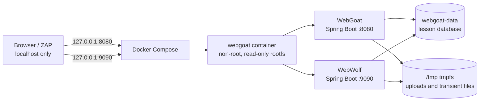

# Container architecture

Compose publishes only loopback addresses on the host. Inside the container,
both Spring Boot applications bind to `0.0.0.0` so Docker can forward traffic
without requiring custom DNS entries. The image drops all Linux capabilities,
sets `no-new-privileges`, runs as `webgoat`, and uses a named volume only for
the mutable lesson database.
