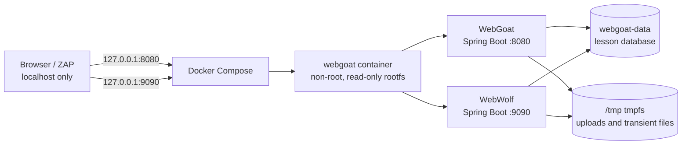

# Container architecture

```mermaid
flowchart LR
    Browser["Browser / ZAP<br/>localhost only"]
    Compose["Docker Compose"]
    Container["webgoat container<br/>non-root, read-only rootfs"]
    WebGoat["WebGoat<br/>Spring Boot :8080"]
    WebWolf["WebWolf<br/>Spring Boot :9090"]
    Volume[("webgoat-data<br/>lesson database")]
    Tmpfs[("/tmp tmpfs<br/>uploads and transient files")]

    Browser -->|"127.0.0.1:8080"| Compose
    Browser -->|"127.0.0.1:9090"| Compose
    Compose --> Container
    Container --> WebGoat
    Container --> WebWolf
    WebGoat --> Volume
    WebWolf --> Volume
    WebGoat --> Tmpfs
    WebWolf --> Tmpfs
```
